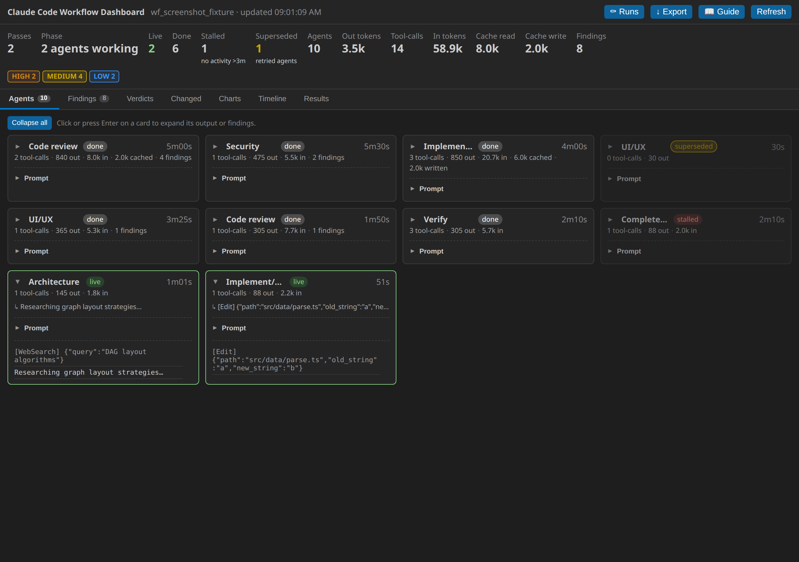
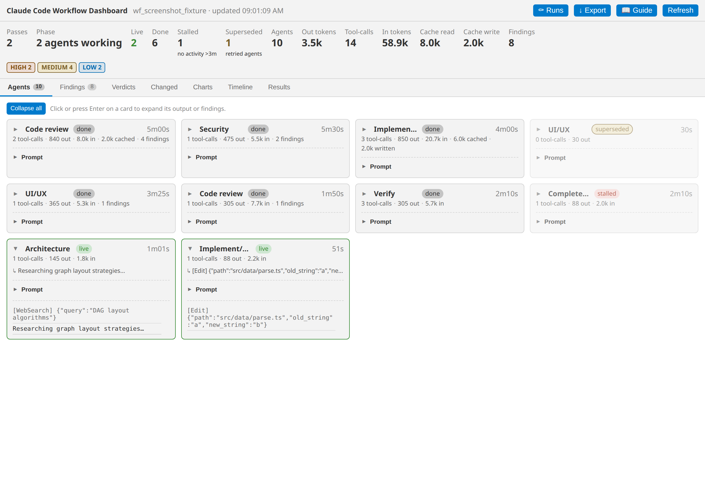
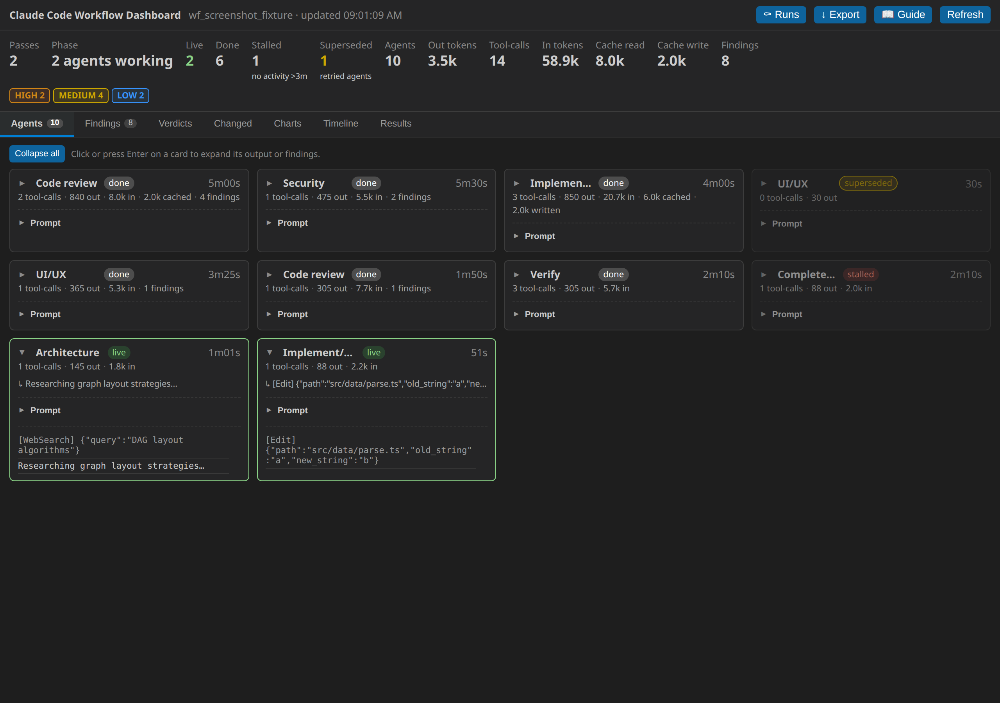
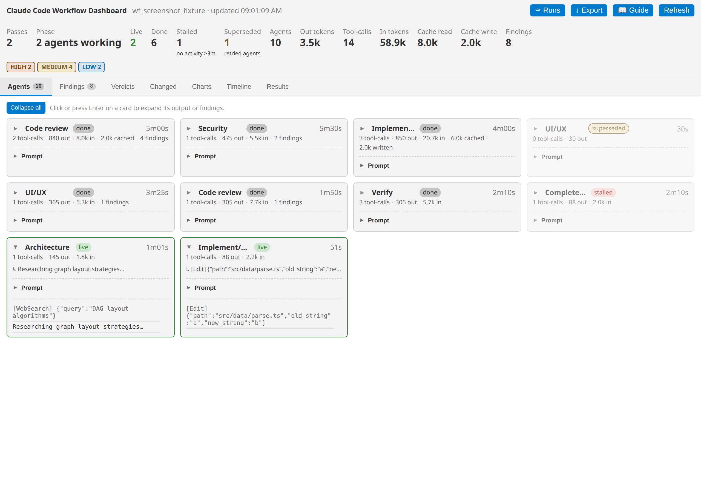
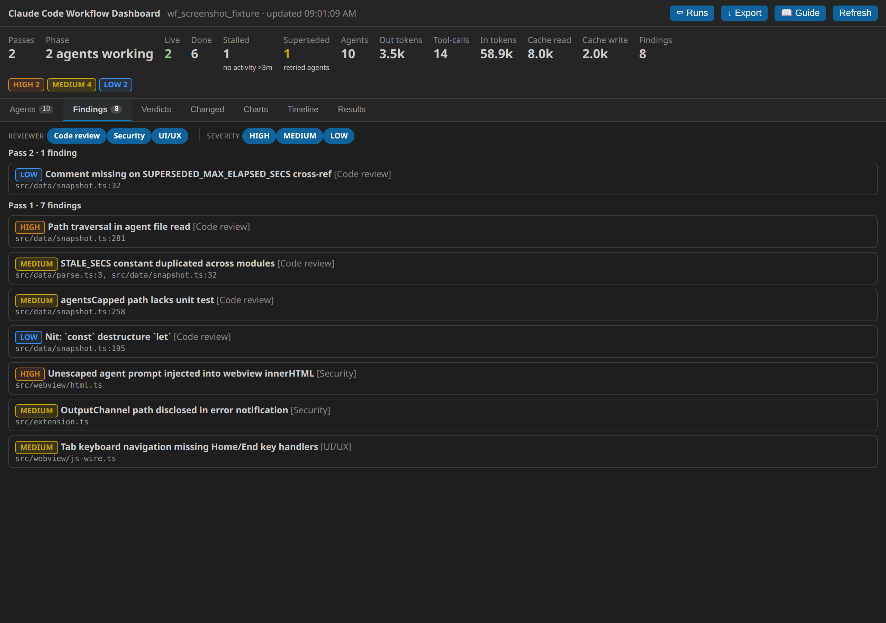
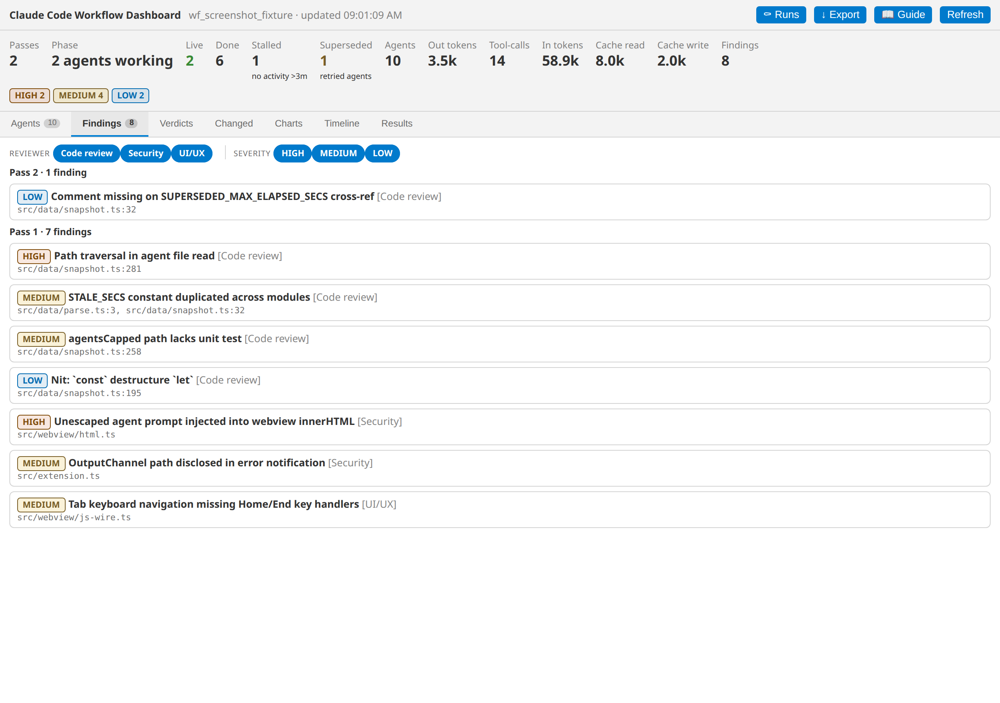
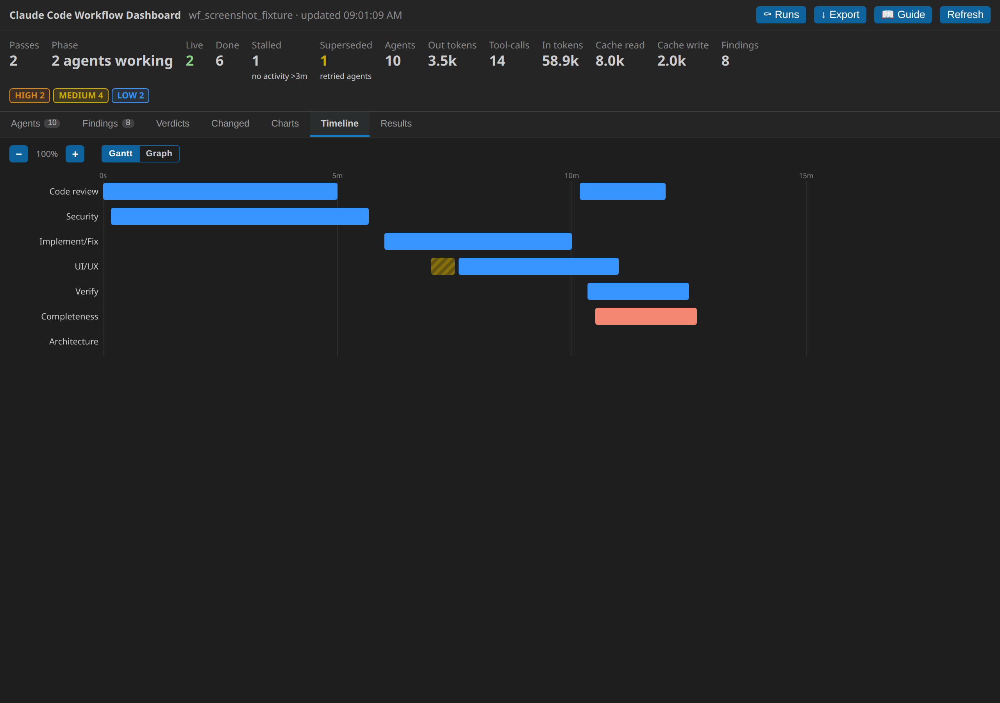
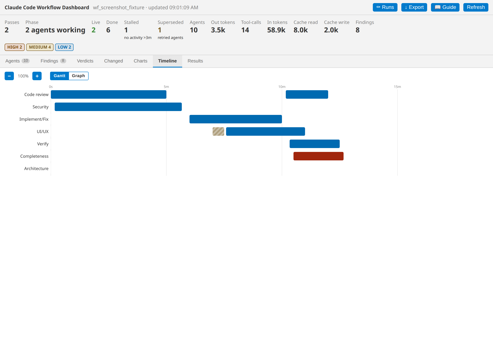

# Claude Code Workflow Dashboard

> **An unofficial, community-built tool. Not affiliated with or endorsed by Anthropic.**

A live, theme-native dashboard for **Claude Code workflow runs**. It reads the
on-disk run journal and per-agent transcripts that every workflow writes, and
renders a continuously-updating view of the loop, every agent, and any review
findings — right inside VS Code.

It is **workflow-agnostic**: the journal/transcript format is identical for all
Claude Code workflows, so the dashboard discovers and visualises whatever run is
active without any per-workflow setup.

## Screenshots

<table>
<tr>
<td align="center"><strong>Dark theme</strong></td>
<td align="center"><strong>Light theme</strong></td>
</tr>
<tr>
<td></td>
<td></td>
</tr>
</table>

### Agents tab

<table>
<tr>
<td></td>
<td></td>
</tr>
</table>

### Findings tab

<table>
<tr>
<td></td>
<td></td>
</tr>
</table>

### Timeline tab

<table>
<tr>
<td></td>
<td></td>
</tr>
</table>

> Screenshots regenerated with `npm run screenshots` (headless Chromium, no VS Code required).

## Features

- **One-click access** — a live **status-bar item** (bottom-left, shows a pulse
  or circuit-board icon depending on whether agents are active) shows the current
  phase and agent counts; click it to open the dashboard. There's also an
  **Activity Bar icon** and the keybinding **`Ctrl/Cmd+Alt+W`**.
- **Tabbed layout** — seven tabs (Agents, Findings, Verdicts, Changed, Charts, Timeline, Results)
  below an always-visible Overview strip. Tab selection and per-tab scroll position are
  remembered across refreshes.
- **Loop & agent overview** — phase, pass number, live/done/dead/superseded agent counts,
  total output tokens, tool-calls, and findings with a severity breakdown.
- **Agent sub-windows** — one card per agent (role, status, elapsed time, token
  & tool-call counts, current activity). Click a card to expand its output: a
  reviewer's findings, a structured result (pretty-printed, e.g. a build
  result), or the live text / tool-call tail of a working agent.
- **Findings** — every `findings[]` result aggregated, with per-role and
  per-severity filter chips; click a finding to read its *Why* and *Fix*. Paginated
  at 50 per page.
- **Timeline** — Gantt-style lanes: one row per agent, bars from start to finish
  (live agents extend to "now"), colored by status. Hover or click to focus an
  agent card.
- **Charts panel** — a horizontal token-bar chart (per-agent output tokens) and a
  cumulative-token trend sparkline. Dependency-free hand-rolled SVG; theme-native colors.
- **Per-agent token & tool-call metrics** — each agent card shows output tokens, input
  tokens (when available), cache read/write tokens, tool-call counts, and finding counts
  in a compact metrics bar.
- **Structured results**, **Verdicts**, and **Changed files** panels.
- **Typed result renderers** — each known agent type (implementer, verifier, reviewer,
  completeness-critic) gets a tailored, readable result view — never a raw JSON dump.
  Unknown shapes fall back to a generic key-value table.
- **Superseded agent detection** — when the workflow engine retries a stalled agent,
  the zombie is shown as "superseded" and excluded from the live count.
- **Live updates** — refreshes instantly on workflow file changes (and on a
  configurable interval), preserving your scroll position and active tab.
- **Run picker** — pin any recent workflow run via the **Select Workflow Run…**
  command (view-title icon or Command Palette). Default remains "Follow newest";
  choosing "Follow newest" at the top of the picker unpins.
- **Export Run as Markdown** — the **Export** button (or **"Claude Workflow: Export Run as Markdown"**
  command) saves the full run report — findings, verdicts, structured results, and agent metrics —
  as a Markdown file. A **Save** dialog or **Copy to clipboard** option is offered.
- **Prompt disclosure** — click the **Prompt** toggle inside any agent card to read the agent's
  opening system prompt, with a **Copy** button.
- **Collapse all / Expand all** — a button in the Agents panel header collapses or expands every
  agent card at once. Individual cards still fold/unfold independently.
- **Keyboard + ARIA** — WAI-ARIA tabs with roving tabindex, ArrowLeft/Right/Home/End navigation;
  state is never communicated by color alone.

## Getting started

Open the dashboard any of these ways:

| Method | How |
| --- | --- |
| Status bar | Click the **Workflow Dashboard** status-bar item at the bottom-left |
| Activity Bar | Click the **Claude Workflow** icon, then the **Dashboard** view |
| Keyboard | **`Ctrl+Alt+W`** (macOS: `Cmd+Alt+W`) |
| Command Palette | **"Claude Workflow: Show Dashboard"** or **"… Open Dashboard in Editor"** |

The dashboard auto-discovers the most recent workflow run under `~/.claude/projects`
by default — no configuration required. To pin a specific run, use
**"Claude Workflow: Select Workflow Run…"** from the Command Palette or the
view-title icon in the Dashboard sidebar pane.

## Authoring workflows for this dashboard

To get the richest view (structured findings, verify results, clean role labels),
write your workflow scripts following **[WORKFLOW-AUTHORING.md](WORKFLOW-AUTHORING.md)**.
It's written so a Claude Code session can follow it directly.

Open it without leaving the editor:

- The **📖 Guide** button in the dashboard's top bar, or the **book icon** in the
  Dashboard view's title bar.
- Command Palette → **"Claude Workflow: Open Workflow Authoring Guide"**.

## Settings

| Setting | Default | Description |
| --- | --- | --- |
| `claudeWorkflow.workflowsGlobBase` | `~/.claude/projects` | Base dir searched recursively for the newest `wf_*` run. |
| `claudeWorkflow.repoDir` | first workspace folder | Repo whose recently-changed files appear in the **Changed files** panel. |
| `claudeWorkflow.refreshMs` | `4000` | Fallback refresh interval (it also refreshes on file changes). |
| `claudeWorkflow.statusBar` | `true` | Show the live status-bar launcher. |
| `claudeWorkflow.roleRules` | `[]` | Optional `{re,label,key}[]` to label agents per workflow. `agentType` from `agent-*.meta.json` is the primary label source; `roleRules` + `classify()` is the fallback for agents without a known `agentType`. |

## How it works

For each run the dashboard reads:

- `journal.jsonl` — one `started`/`result` record per `agent()` call. `result`
  payloads are interpreted by shape: an array under `findings` becomes the
  Findings panel; any other object becomes a Structured result; a string is the
  agent's text output.
- `agent-*.jsonl` — each agent's transcript, used for token counts, tool-call
  counts, the current-activity line, and the expandable output tail.
- `agent-*.meta.json` — the `agentType` field drives role labelling and typed
  result renderers.

Agent status is derived as **done** (a result was recorded), **run** (its
transcript changed within the last 3 minutes), **dead** (interrupted — no result
and no recent activity), or **superseded** (a newer same-role agent was spawned
before this one produced a result).

Nothing is written; the extension only reads these files.

## Build & install from source

```bash
npm install -g @vscode/vsce      # once
vsce package                     # -> claude-code-workflow-dashboard-<version>.vsix
code --install-extension claude-code-workflow-dashboard-*.vsix --force
```

Or press **F5** in this folder to launch an Extension Development Host.

## Regenerating screenshots

```bash
npm run screenshots   # runs make-sample-run.mjs then screenshot.mjs (headless Chromium)
npm run make-fixture  # write the deterministic fixture only (to .review-tmp/fixture-run)
```

Playwright with Chromium is required (`npx playwright install chromium`).

## Publishing

This extension publishes under the `malte-langermann` Marketplace publisher via the
GitHub Actions **Release** workflow (push a `vX.Y.Z` tag). Nightly pre-releases
are published by the **Nightly** workflow. CI validates and packages every push.

## Roadmap & contributing

The project tracks progress in **[ROADMAP.md](ROADMAP.md)**. M0–M4 (TypeScript
migration, robustness, metrics + charts, Markdown export, timeline, launch polish,
screenshots, community files, Open VSX) are shipped in v1.0.0.
Project orientation for contributors lives in **[CLAUDE.md](CLAUDE.md)**, and the
on-disk run format the dashboard reads is documented in **[docs/DATA-FORMAT.md](docs/DATA-FORMAT.md)**.

## Disclaimer

An unofficial, community-built tool. Not affiliated with or endorsed by Anthropic.

## License

GPL-3.0-or-later — see [LICENSE](LICENSE).

Copyright (C) 2026 Malte Langermann.
